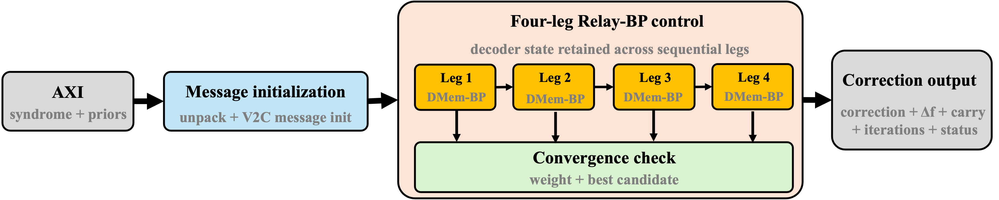

# RelayHLS

RelayHLS is a configurable Vitis HLS implementation of Relay belief
propagation (Relay-BP) for FPGA-based quantum LDPC decoding. It maps the
complete decoder flow to a shared, banked datapath: fixed-point message
initialization, check-node and variable-node updates, up-to-four sequential
DMem-BP legs, convergence checking, candidate selection, and correction-related
processing.



The repository accompanies the paper *RelayHLS: Low-Latency FPGA Acceleration
of Relay-BP toward Trapped-Ion Quantum Error Correction*. It contains the three
independently configurable implementations used for the VCU118 architecture
study, together with graph generators, validation tests, and reproducibility
scripts.

## Architecture at a Glance

- **Reusable CNU/VNU lanes:** `CNU_PARALLEL` and `VNU_PARALLEL` select the
  synthesis-time compute width.
- **Banked decoder state:** V2C, C2V, prior, posterior, syndrome, and
  correction memories remain on chip across Relay-BP legs.
- **Generated static mapping:** graph-specific tables assign each scheduled
  edge access to a lane, local slot, BRAM bank, and bank address while checking
  the dual-port constraint.
- **Fixed-point datapath:** message magnitude, posterior guard width, packing,
  and memory factors are compile-time parameters.
- **Complete control path:** the HLS top includes multi-leg execution,
  convergence checks, minimum-cost candidate retention, and correction-related
  outputs.

## Included Variants

| Variant | CNU lanes | VNU lanes | Check lanes | Purpose |
|---|---:|---:|---:|---|
| `RelayBP_pack64_c8_v16` | 8 | 16 | 8 | Resource-oriented point |
| `RelayBP_pack64_c16_v16` | 16 | 16 | 16 | CNU-scaling point |
| `RelayBP_pack64_c16_v32` | 16 | 32 | 16 | Lowest-latency evaluated point |

All three variants use 64-bit packed binary interfaces, 64 message-memory
banks, four-bit message magnitudes, and the same deterministic
1,008-detector/9,000-candidate-fault/8,064-edge benchmark graph. Each directory
is self-contained so its Vitis project and generated constants can be opened,
validated, and implemented independently.

## Requirements

- AMD Vitis HLS and Vivado 2025.2
- VCU118 target device `xcvu9p-flga2104-2L-e`
- Python 3.9 or newer for graph generators and unit tests
- Bash for repository-level automation

The scripts first look for the laboratory environment command
`vivado-2025.2`. On another system, set `VITIS_BIN` and `VIVADO_BIN` to the
corresponding installation directories.

## Quick Start

Run repository checks and generator unit tests without invoking Vitis:

```bash
./scripts/check_project.sh
./scripts/run_unit_tests.sh
```

Run C simulation for all three variants:

```bash
./scripts/run_csim_all.sh
```

Run HLS synthesis and direct Vivado out-of-context implementation:

```bash
./scripts/run_hls_ooc_all.sh
```

Run only the C16/V32 variant:

```bash
cd variants/RelayBP_pack64_c16_v32
./scripts/run_hls_ooc_10ns.sh
```

The HLS top function is `relaybp_top`. See
[`docs/hls_flow.md`](docs/hls_flow.md) for the generated reports and
[`docs/reproducibility.md`](docs/reproducibility.md) for the evaluation
boundaries used in the paper.

## Adapting a Graph

Each variant provides two generator entry points:

- `tools/generate_fake_h_constants.py` recreates the controlled synthetic
  benchmark and verifies schedule/bank feasibility.
- `tools/generate_real_circuit_constants.py` imports a detector-fault graph
  derived from a circuit model.

Keep the selected parameters in `configs/constants_config.json`, regenerate
`src/constants.h`, run the generator tests, and pass C simulation before
synthesis. The generators reject schedules that exceed the available
true-dual-port BRAM accesses.

## Results and Reproducibility

Compact post-route and stage-level results are provided under [`results/`](results/).
Generated Vitis/Vivado build products are intentionally excluded; this keeps
the repository reviewable while the committed configurations, source, and
static tables reproduce the evaluated design points.

## Citation

Citation metadata is provided in [`CITATION.cff`](CITATION.cff). If you use
RelayHLS, please cite the associated paper and this repository.

## License

RelayHLS is released under the [MIT License](LICENSE).
